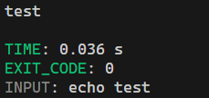
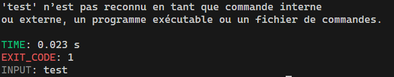

<h3 align="center">
    Runned
</h3>

---

<p align="center">
    ⚙️ Runned is a simple tool to check the execution time of terminal commands on Windows.
</p>

---

### 🖼 Screenshot



### ❓ How to use
~~~
USAGE: runned.exe <your commands>

OPTIONS:
  -e --exitcode    Display the exit code of the executed command.
  -i --input       Display the input given by the user.
  -a --accuracy    Display time with more precision.
~~~

### ❓ How to run or buidl
To run, you will need to download the lua interpreter. You can find it [here](https://luabinaries.sourceforge.net/download.html). <br>
Then, run the following command:

```console
$ lua .\src\runned.lua
```

To build, you will need to download a lua compiler. You can find the one I use [here](https://github.com/samyeyo/rtc). <br>
Then, run the following command:

```console
$ rtc -s -c -o .\build\runned.exe .\src\runned.lua
```

If you want to download a build, check the [build](./build/) folder.
